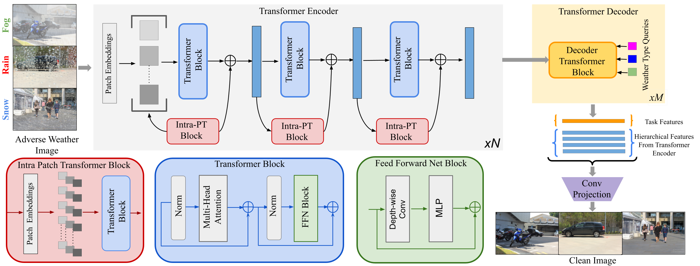

# TransWeather

 <a href="https://arxiv.org/abs/2111.14813"> </a> 

Official Code for the paper [TransWeather: Transformer-based Restoration of Images Degraded by Adverse Weather Conditions](https://arxiv.org/abs/2111.14813), CVPR 2022

[Paper](https://arxiv.org/abs/2111.14813) | [Website](https://jeya-maria-jose.github.io/transweather-web/)

### About this repo:

This repo hosts the implentation code for the paper "TransWeather". We also provide code for a strong transformer baseline for weather removal tasks.

## Introduction

Removing adverse weather conditions like rain, fog, and snow from images is an important problem in many applications. Most methods proposed in the literature have been designed to deal with just removing one type of degradation. Recently, a CNN-based method  using neural architecture search (All-in-One) was proposed  to remove all the weather conditions at once. However, it has a large number of parameters as it uses multiple encoders to cater to each weather removal task and still has scope for improvement in its performance. In this work, we focus on developing an efficient solution for the all adverse weather removal problem. To this end, we propose TransWeather, a transformer-based end-to-end model with just a single encoder and a decoder that can restore an image degraded by any weather condition. Specifically, we utilize a novel transformer encoder using intra-patch transformer blocks to enhance attention inside the patches to effectively remove smaller weather degradations. We also introduce a transformer decoder with learnable weather type embeddings to adjust to the weather degradation at hand. TransWeather achieves significant improvements across multiple test datasets over both All-in-One network as well as methods fine-tuned for specific tasks. 

<p align="center">
  
</p>

## News [Update]:

A change in the PSNR values are observed as the calulation is done before saving the image which is not adept with previous works. However, we still get a better performance in most datasets (27.96 vs All-in-One's 24.71). It can also be noted that the TransWeather model can be further finetuned to get a better performance on individual datasets. These updates will be reflected on the new arxiv version.

## Using the code:

The code is stable while using Python 3.6.13, CUDA >=10.1

- Clone this repository:
```bash
git clone https://github.com/jeya-maria-jose/TransWeather
cd TransWeather
```

To install all the dependencies using conda:

```bash
conda env create -f environment.yml
conda activate transweather
```

If you prefer pip, install following versions:

```bash
timm==0.3.2
mmcv-full==1.2.7
torch==1.7.1
torchvision==0.8.2
opencv-python==4.5.1.48
```


## Datasets:

### Train Data:

TransWeather is trained on a combination of images sampled from Outdoor-Rain, Snow100K, and Raindrop datasets (similar to [All-in-One (CVPR 2020)](https://openaccess.thecvf.com/content_CVPR_2020/papers/Li_All_in_One_Bad_Weather_Removal_Using_Architectural_Search_CVPR_2020_paper.pdf)), dubbed as "All-Weather", containing 18069 images. It can be downloaded from this [link](https://drive.google.com/file/d/1tfeBnjZX1wIhIFPl6HOzzOKOyo0GdGHl/view?usp=sharing).


### Dataset format:

Download the datasets and arrange them in the following format. T
```
    TransWeather
    ├── data 
    |   ├── train # Training  
    |   |   ├── <dataset_name>   
    |   |   |   ├── input         # rain images 
    |   |   |   └── gt            # clean images
    |   |   └── dataset_filename.txt
    |   └── test  # Testing         
    |   |   ├── <dataset_name>          
    |   |   |   ├── input         # rain images 
    |   |   |   └── gt            # clean images
    |   |   └── dataset_filename.txt
```

### Text Files:

[Link](https://drive.google.com/file/d/1UsazX-P3sPcDGw3kxkyFWqUyNfhYN_AM/view?usp=sharing)


## Evaluation Code:


To run the evaluation for specific test datasets, run the following commands:

```   
python test_snow100k.py -exp_name TransWeather_weights
```

```   
python test_test1.py -exp_name TransWeather_weights
```

```   
python test_raindropa.py -exp_name TransWeather_weights
```

These scripts will calculate the performance metrics as well as save the predictions in the results folder.


## Training the network:

To train the network on All-weather dataset, run the following command:

```
python train.py  -train_batch_size 32 -exp_name Transweather -epoch_start 0 -num_epochs 250
```

## Extensions:

Note that Transweather is built to solve all adverse weather problem with a single model. We observe that, additionally TransWeather can be easilty modified (removing the transformer decoder) to just focus on an individual restoration task. To train just the Transweather-encoder on other datasets (like Rain-800), organize the dataset similar to all-weather and run the following command: 

```
python train-individual.py  -train_batch_size 32 -exp_name Transweather-finetune -epoch_start 0 -num_epochs 250
```

Change ```train-individual.py``` with the necesarry details of the data to be trained on. Note that the network used there is a sub-section of our original Transweather architecture without the weather queries.

### Acknowledgements:

This code-base uses certain code-blocks and helper functions from [Syn2Real](https://github.com/rajeevyasarla/Syn2Real), [Segformer](https://github.com/NVlabs/SegFormer), and [ViT](https://github.com/lucidrains/vit-pytorch).

### Citation:

```
@misc{valanarasu2021transweather,
      title={TransWeather: Transformer-based Restoration of Images Degraded by Adverse Weather Conditions}, 
      author={Jeya Maria Jose Valanarasu and Rajeev Yasarla and Vishal M. Patel},
      year={2021},
      eprint={2111.14813},
      archivePrefix={arXiv},
      primaryClass={cs.CV}
}
```
